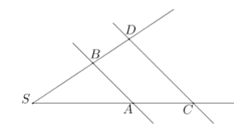

# Geometrija - razni zadaci

### Zadatak 1

#### NN
#### NN

#### Tekst zadatka
Da li su prave AB,CD paralelne, ako vrijedi : SA=2, AC=1,5;   SB=3, BD=2,5?  



#### Rješenje zadatka
<details>
<summary>Klikni za rješenje</summary>
```
SA:AC=SB:BD
2:1,5=3:2,5    

$\dfrac{4}{3}=\dfrac{6}{5}$

$\dfrac{20}{15}=\dfrac{18}{15}$

Jednakost nije tačna, pa prave nisu paralelne.
```
</details>

---

### Zadatak 2

#### NN
#### NN

#### Tekst zadatka
Odredi pravu BD ako vrijedi : SA=2, AC=1,5, SB=8, duži AB i CD su paralelne.


#### Rješenje zadatka
<details>
<summary>Klikni za rješenje</summary>
```
SB:BD=SA:AC 

$BD = \dfrac{AC * SB}{SA}=\dfrac{1.5 * 8}{2} = 6$

```
</details>

---

